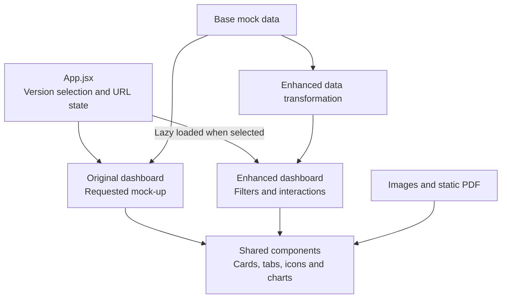

# Largo Celebrity Analytics Dashboard

A responsive recreation of Largo's celebrity analytics dashboard, built with dummy data for the Full Stack Developer assignment. The project includes the requested original interface and an optional enhanced version with additional interactions.

## Links

- [Live application](https://hxndev.github.io/Largo_Assignment/)
- [Original version](https://hxndev.github.io/Largo_Assignment/?version=original)
- [Enhanced version](https://hxndev.github.io/Largo_Assignment/?version=enhanced)
- [Implementation and design report](docs/Hassan-Largo-Assignment-Report.pdf)

## Versions

| Feature | Original | Enhanced |
| --- | --- | --- |
| Responsive dashboard layout | Yes | Yes |
| Date and demographic controls | Limited behavior | Updates the dashboard dataset |
| Interactive chart tooltips | No | Yes |
| Chart series controls | No | Yes |
| Expanded chart view | No | Yes |
| Dashboard PDF export | No | Browser print-to-PDF |
| Celebrity One-Sheet download | No | Static PDF download |

The original version remains focused on reproducing the supplied mock-up. The enhanced version is loaded separately and reuses the same cards, charts, icons, and data structures.

## Architecture



Mock values are stored in dedicated data modules and passed to presentation components through props. This keeps the data source separate from the interface and provides a clear replacement point for a future API integration.

## Technology

- **React** for reusable components and interface state
- **Recharts** for responsive charts and enhanced interactions
- **Vite** for local development, bundling, and code splitting
- **Plain CSS** for the original, enhanced, responsive, and print layouts
- **GitHub Actions and GitHub Pages** for automated static deployment

The dummy Celebrity One-Sheet was prepared once with Python and ReportLab. The deployed application serves the finished PDF directly and does not generate documents at runtime.

## Project structure

```text
src/
├── assets/              Logo and optimized celebrity image
├── components/          Shared dashboard components
│   └── charts/          Reusable Recharts visualizations
├── data/                Base and enhanced mock-data logic
├── enhanced/            Enhanced dashboard and interactions
├── original/            Original dashboard composition
├── App.jsx              Version selection and lazy loading
├── main.jsx             React entry point
└── styles.css           Shared and original styles

public/documents/        Downloadable Celebrity One-Sheet
docs/                    Assignment report
```

## Run locally

Requires Node.js and npm.

```bash
npm ci
npm run dev
```

Open the local URL shown by Vite. Use `?version=original` or `?version=enhanced` to open a specific version directly.

## Production build

```bash
npm run build
npm run preview
```

Vite is configured with the `/Largo_Assignment/` base path required by GitHub Pages. Pushes to `main` trigger the deployment workflow in `.github/workflows/deploy.yml`.
